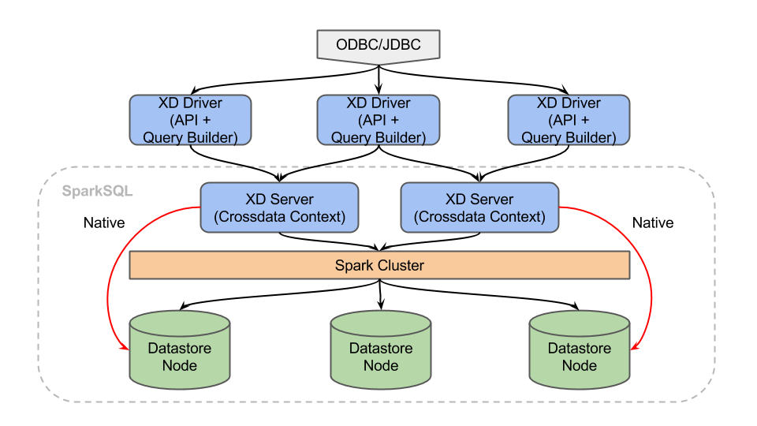

==================
Architecture guide
==================

Crossdata is a framework that aims to optimize and leverages the features of Apache Spark and take advantage of the
benefits of a P2P architecture. CrossdataContext is an extension of the SQLContext of Spark and contains a bunch of
improvements with the goal of speeding up your queries and add features required by developers and the community. In
addition, Crossdata tries to unify the access and management of different datastores, that is, Crossdata is the
perfect tool when you want to perform operational and analytic queries using only one framework.

Thus, Crossdata makes possible to resolve queries natively, without clogging the Spark Cluster and, not only that, but
also provides some improvements such as more efficient filter push-downs, metadata discovery and persistent catalog.
Other important point is that it also aims to unify the combination between batch and streaming resources, from both the
SQL-interface and the API.

Scalability and high availability are two of the main goals of Crossdata and the use of the
`Akka framework <http://akka.io/>`_ and the actor model system allow us to have a reliable P2P architecture where
bottleneck are not present and load balance is a key characteristic of the Crossdata architecture. Akka contributes to
make Crossdata a powerful concurrent and distributed application.

That way, a driver library is provided to connect to several servers. These messages among the different nodes of the
Crossdata system are achieved taking advantage of the features of Akka, getting a high performance, resilient,
elastic and decentralized architecture.

It's important to note that Crossdata can be used just as a library for your already existent Spark cluster or you
can use the whole stack in order to make the most of the distributed architecture of Crossdata.

Moreover, Crossdata provides an API in Scala and Java to built your own application and get the benefits of this
system. One of the applications using this API is the Stratio Crossdata ODBC and JDBC library, which let us to
connect any BI tool and have access to all this datastores, getting the results as fast as possible. To complete all
this, a query builder is also given to ease the query construction process.
